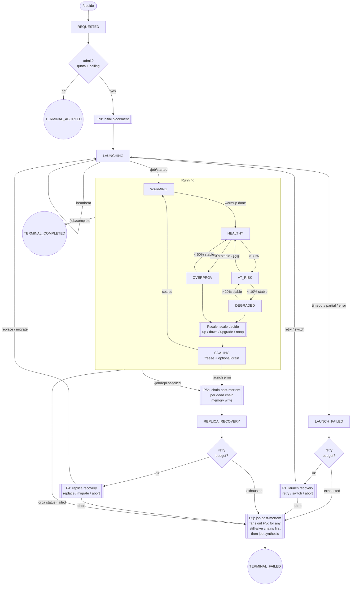

# Koi Harness Architecture v0

**Goal:** migrate Koi's production agent loop from two broad prompts into a small FSM-driven harness that precomputes evidence, presents bounded action menus, and lets smaller local LLMs make reliable decisions without mandatory info-seeking.

This document describes the target v0 architecture for the live Koi production path. It does not rely on the old ensemble path.

---

## 1. Why This Exists

Koi currently relies on a strong model to read large prompts, decide what tools to call, collect data, do arithmetic, reason about placement/runtime tradeoffs, and finally choose an action. That is workable with strong hosted models, but the production target is a local CPU-capable, heavily quantized LLM.

Small local models can reason, but they are weaker at:

- long-context synthesis
- tool orchestration
- remembering API shapes
- doing multi-step arithmetic reliably
- staying inside action policy under pressure

The harness inverts the responsibility:

- deterministic code fetches and compresses evidence
- deterministic code generates feasible action menus
- deterministic code validates and executes actions
- the LLM reasons over the prepared packet and chooses an action

The LLM is not reduced to a picker bot. It may inspect packet details, request comparisons, ask for counterfactual menus, and choose a non-top-ranked option if it can justify the tradeoff. The harness constrains what can be executed, not how the LLM thinks.

---

## 2. Design Principles

### Max Work, Min States

The FSM should stay small. Cluster reality can be messy, but most messiness should live in packet fields, guards, retry budgets, and evidence annotations, not new top-level states.

Use durable states for lifecycle and health. Use flags for everything else.

### Spoonfeed Evidence, Preserve Reasoning

The LLM should not have to discover basic facts every time. The packet should already contain:

- workload/SLO/cost constraints
- current runtime state
- PerfDB evidence
- memory outcomes and diagnoses
- model/GPU physics
- quota and beta priors
- recent failure signals from fresh failures
- ranked feasible actions

The LLM can still ask for more detail, but the default path should require zero external info-seeking.

### Bound Execution, Not Thought

The LLM may reason freely, inspect detail sections, compare options, and disagree with the ranker. It may not invent raw cluster mutations. Final execution happens only through a validated `action_id` that maps to a deterministic executor payload.

### Production Path Only

This architecture targets the live path:

- `koi/server.py`
- `koi/agent.py`
- `koi/monitor.py`
- `koi/runtime_state.py`
- `koi/resource_ledger.py`
- `koi/tools/*`
- `koi/runtime_policy.py`
- `koi/costing.py`

The old ensemble path is out of scope.

---

## 3. Final v0 FSM

This is the business-level FSM for v0. Do not expand it unless a condition is truly durable and operationally distinct.



### States

| State | Meaning |
| --- | --- |
| `REQUESTED` | `/decide` accepted and parsed. |
| `LAUNCHING` | Launch requested, heartbeat/start/failure pending. |
| `LAUNCH_FAILED` | Launch path failed before serving. |
| `WARMING` | Job or replica started, metrics not stable yet. |
| `HEALTHY` | Running with enough SLO headroom. |
| `AT_RISK` | Running below healthy threshold but not yet degraded. |
| `DEGRADED` | Stable falling-behind condition. |
| `OVERPROV` | Stable over-provisioned condition. |
| `SCALING` | Scale/kill/migrate action in flight; monitor freeze applies. |
| `REPLICA_RECOVERY` | A dead chain was diagnosed and recovery decision is needed. |
| `TERMINAL_COMPLETED` | Job completed. |
| `TERMINAL_FAILED` | Job failed after post-mortem. |
| `TERMINAL_ABORTED` | Koi intentionally refused or aborted. |

### Not States

These should be packet fields, guards, reason codes, or evidence annotations:

- quota found/not found
- under/over cost ceiling
- retry budget remaining/exhausted
- action in flight/cooldown
- metrics stale
- planned config vs actual config drift
- evidence quality
- exact PerfDB vs proxy vs analytical source
- fresh spot preemption
- recent no-capacity failure
- tenant id

---

## 4. High-Level Harness Flow

Every LLM decision follows the same outer pipeline:

```text
production event
-> StateReducer
-> PacketBuilder
-> MenuBuilder
-> PromptTemplate
-> LLMReasoner
-> Validator
-> Executor
-> Recorder
```

| Stage | Responsibility |
| --- | --- |
| `StateReducer` | Derive the FSM state from current production state and event context. |
| `PacketBuilder` | Pull deterministic evidence into a transition packet. |
| `MenuBuilder` | Pre-filter infeasible options and rank valid choices. |
| `PromptTemplate` | Render a small state-specific prompt from the packet/menu. |
| `LLMReasoner` | Let the model inspect packet details and choose a final action. |
| `Validator` | Check output shape, action id, safety, and freshness. |
| `Executor` | Map action id to current production operations. |
| `Recorder` | Write decisions, outcomes, diagnoses, recent failure signals, and events. |

The LLM sees a bounded action surface. The executor performs cluster mutation.

---

## 5. State Ownership in v0

Do not add a second authoritative FSM database in v0. Derive state from current production sources.

| Harness State | Existing Source |
| --- | --- |
| `REQUESTED` | `/decide` request path. |
| `LAUNCHING` | `MonitoringLoop._pending_launches` and runtime `pending_launches`. |
| `WARMING` | `JobTracker.status == warming_up`. |
| `HEALTHY` | `JobTracker.status == on_track`. |
| `AT_RISK` | `JobTracker.status == at_risk`. |
| `DEGRADED` | `JobTracker.status == falling_behind`. |
| `OVERPROV` | `JobTracker.status == over_provisioned`. |
| `SCALING` | `JobTracker.action_in_progress` / `action_freeze_until`. |
| `REPLICA_RECOVERY` | `/job/replica-failed` handler context. |
| `TERMINAL_COMPLETED` | `/job/complete`. |
| `TERMINAL_FAILED` | launch/job failure after post-mortem. |
| `TERMINAL_ABORTED` | deterministic admission abort or LLM-selected abort. |

Explicit FSM tables can be added later for audit/replay if needed, but they are not required for v0. Early persistence should focus only on targeted data:

- retry budgets
- recent failure signals
- optional packet/choice audit rows if debugging requires them

---

## 6. New Module Layout

```text
koi/harness/
  __init__.py
  schemas.py
  fsm.py
  controller.py
  packets.py
  menus.py
  prompts.py
  reasoner.py
  validator.py
  executor.py
  cooloff.py
  p0.py
  p1.py
  pscale.py
  p4.py
  postmortem.py
```

### Suggested Responsibilities

| Module | Responsibility |
| --- | --- |
| `schemas.py` | Pydantic models for packets, action options, choices, prompt outputs. |
| `fsm.py` | State reducer and transition helpers. Derived-state only in v0. |
| `controller.py` | Orchestrates packet -> menu -> prompt -> reasoner -> validate -> execute. |
| `packets.py` | Shared packet-building utilities and detail section management. |
| `menus.py` | Common menu ranking/filtering primitives. |
| `prompts.py` | Shared system prompt and micro-prompt templates. |
| `reasoner.py` | LLM invocation, typed final output, packet-scoped read tools. |
| `validator.py` | Action validation and fallback selection. |
| `executor.py` | Deterministic mapping from action id to production operation. |
| `cooloff.py` | Recent failure signal read/write and menu ranking evidence. |
| `p0.py` | Initial placement packet/menu/prompt logic. |
| `p1.py` | Launch recovery packet/menu/prompt logic. |
| `pscale.py` | Runtime scale/up/down/upgrade/noop logic. |
| `p4.py` | Replica recovery logic. |
| `postmortem.py` | P5c and P5j diagnosis logic. |

---

## 7. Core Schemas

### TransitionPacket

One shared outer packet shape should feed all prompts.

```python
class TransitionPacket(BaseModel):
    packet_id: str
    job_id: str
    tenant_id: str = "default"
    state: HarnessState
    transition_type: TransitionType
    job_context: dict
    runtime_context: dict = {}
    failure_context: dict = {}
    policy_context: dict = {}
    evidence_summary: dict
    action_options: list[ActionOption]
    detail_sections: dict[str, Any]
    guards: dict[str, Any]
```

### ActionOption

Each action option is executable only through a deterministic payload reference.

```python
class ActionOption(BaseModel):
    action_id: str
    action_type: str
    summary: str
    rank: int
    valid: bool
    hard_feasibility: dict
    performance: dict
    physics: dict
    evidence: dict
    availability: dict
    cost: dict
    risk: dict
    executor_payload_ref: str
    detail_refs: list[str]
```

### ChosenAction

The final LLM output should be typed but not overly restrictive.

```python
class ChosenAction(BaseModel):
    action_id: str
    confidence: float
    rationale: str
    evidence_used: list[str]
    why_not_top_choice: str | None = None
    requested_more_context: bool = False
```

---

## 8. Packet Evidence Model

The packet has two evidence layers.

### Core Option Card

The prompt always sees this. It should be short and decision-ready.

Recommended fields:

- hard feasibility
  - `vram_fit`
  - `vram_headroom_gb`
  - `tp_heads_valid`
  - `pp_layers_valid`
  - `kv_heads_per_tp_shard`
  - `crosses_node_boundary`
  - `capacity_ok`
  - `runtime_supported`
- performance
  - `predicted_tps`
  - `required_tps`
  - `meets_slo`
  - `prediction_source`
  - `prediction_confidence`
- physics
  - `bandwidth_per_param`
  - `flops_per_param`
  - `roofline_decode_tps`
  - `io_ratio`
  - `gqa_ratio`
- evidence
  - `proxy_model`
  - `proxy_distance`
  - `memory_successes`
  - `memory_failures`
- availability
  - `live_quota`
  - `beta_launch_success_pct`
  - `recent_no_capacity_failures`
  - `recent_same_scope_failure`
  - `last_failure_age_min`
  - `recent_failure_reason`
- cost
  - `cost_per_hour`
  - `projected_total_cost_usd`
  - `under_roofline`

### Detail Sections

The detail sections store rich evidence that the LLM can inspect when needed. This is where the 130+ PerfDB/memory variables belong.

Examples:

```text
physics:<action_id>
perfdb_exact:<action_id>
perfdb_proxy:<action_id>
memory_success:<action_id>
memory_failure:<action_id>
quota:<action_id>
recent_failures:<action_id>
runtime_metrics:<action_id>
```

The LLM should not receive every section by default. It should receive section references and use packet-scoped read tools when deeper context is useful.

---

## 9. Physics Strategy

Physics is first-class deterministic evidence. It should not be left as optional LLM research.

For `P0`, `P1`, and `P4`, packet builders should:

1. Fetch model features through `koi.tools.physics.get_model_features()`.
2. Compute the physics vector for the requested model.
3. Query exact PerfDB records first.
4. If exact coverage is sparse or absent, run physics-vector similar-model fallback with `find_similar_models()`.
5. Compute per-config features with `koi.model_features.compute_config_features()`.
6. Assign prediction source and confidence.
7. Build option cards with physics summaries plus rich detail sections.

Prediction source should be explicit:

| Source | Meaning |
| --- | --- |
| `memory_verified` | Past successful outcome for this model/config or very close config. |
| `perfdb_exact` | Exact or near-exact benchmark record. |
| `perfdb_interpolated` | Same model, scaled by workload/config differences. |
| `physics_proxy` | Similar model found by physics-vector distance. |
| `analytical_roofline` | No useful empirical evidence; physics-only estimate. |

The LLM should see the source and confidence on every option.

---

## 10. Recent Failure Evidence

Long-term beta priors are useful but too slow for fresh failure avoidance. Add short-horizon recent-failure evidence, not hard cooldown enforcement.

### Why

If `A100 spot us-east-1` was preempted minutes ago, the next decision should know that immediately. This is not just a long-term prior update; it is a fresh operational risk. However, v0 should avoid arbitrary rules like "block this for 30 minutes" because the failed scope may still be the only SLO-saving path.

### Scope

For spot/no-capacity failures, key recent failure signals by:

```text
gpu_type + instance_type + region + market
```

For OOM/performance-specific failures, optionally include:

```text
tp + pp + dp
```

### Behavior

- `P5c` writes when a scope failed, why it failed, and what scope it applies to.
- `P0`, `P1`, `Pscale`, and `P4` consume recent failures as ranking evidence.
- Keep options valid unless they are truly infeasible (`no_quota`, invalid topology, confirmed unchanged OOM, etc.).
- Deterministically downrank same-scope recent failures instead of hard-blocking them.
- Surface the failure evidence directly on the card: `last_failed_at`, `age_minutes`, `diagnosis_code`, `same_scope`, and `recommendation`.
- Let the LLM choose a recently failed scope if it is still the only viable SLO-saving path.
- Do not globally blacklist a GPU family because one market/region/scope failed.

The persisted table may keep the historical `cooloffs` name for implementation continuity, but the intended semantics are recent-failure signals and ranking evidence, not rigid cooldown timers.

Example card annotation:

```json
{
  "recent_failure": {
    "same_scope": true,
    "last_failed_at": "2026-04-27T21:43:00Z",
    "age_minutes": 7,
    "diagnosis_code": "spot_preemption",
    "recommendation": "Prefer on_demand or another GPU if available"
  }
}
```

---

## 11. Prompt and Tool Policy

### Shared System Prompt

All micro-prompts should share a small system prompt:

```text
You are Koi's bounded decision agent. Start from the provided menu and evidence.
The ranking is guidance, not a command. You may inspect packet details or request
a counterfactual menu if needed. You must end with a valid action_id from the
final menu. Do not invent executable actions.
```

### Runner Behavior

- Use a low temperature such as `0.1` or `0.2` for decision prompts.
- Use typed final output.
- Allow bounded packet-scoped exploration.
- Use `max_iterations=3` for `P0`, `P1`, `Pscale`, and `P4`.
- Use `max_iterations=2` for `P5c` and `P5j`.
- Accept valid non-top choices and log them.
- Fall back only on invalid, unsafe, stale, or timed-out outputs.

### Packet-Scoped Read Tools

Expose tools like:

```text
read_option_detail(action_id, section)
compare_options(action_ids, lens)
read_packet_section(section_id)
request_counterfactual(goal, constraints)
request_menu_revision(reason_code)
```

These tools let the LLM explore without forcing it back into raw global tool orchestration.

### Per-Prompt Tool Gating

| Prompt | Tools |
| --- | --- |
| `P0` | Packet read tools and quota detail. No action tools. |
| `P1` | Packet read tools, quota detail, failure/prior detail. No action tools. |
| `Pscale` | Packet read tools, runtime detail, optional scale/kill escape hatch. |
| `P4` | Packet read tools, failure/prior detail, optional replacement path. |
| `P5c` | Read-only only. |
| `P5j` | Read-only only. |

The default executor path should not require the LLM to call action tools directly.

---

## 12. Prompt-Specific Plans

### P0: Initial Placement

Triggered by `REQUESTED` after admission succeeds.

Packet builder:

- parse workload/SLO/cost constraints
- fetch resources and apply the ledger
- query memory outcomes and decisions
- query exact PerfDB
- run physics-vector proxy fallback if needed
- compute physics features per candidate
- compute total job cost
- annotate quota, priors, and recent failure signals
- build a launch menu

Menu options:

- `launch`
- `abort_no_feasible_option`
- `operator_review` if needed

Executor:

- returns a normal `AgentDecision`
- preserves `/decide` response shape
- lets existing server code record the decision and reserve GPUs

### P1: Launch Recovery

Triggered by `LAUNCH_FAILED` with retry budget remaining.

Packet builder:

- read failed launch attempts
- classify failure categories
- read beta priors and recent failure signals
- reconstruct job request from the original decision
- generate retry/switch/abort options

Menu options:

- retry same topology with different market
- switch GPU family
- switch instance type
- switch spot to on-demand
- abort

Executor:

- v0 should prefer re-decide/recovery through the current Orca flow
- avoid adding a new Koi-originated launch primitive unless needed later

### Pscale: Runtime Scaling

Triggered by `DEGRADED` or `OVERPROV`.

Packet builder:

- read group runtime state
- aggregate TPS
- compute required TPS
- compute time left and tokens remaining
- inspect current replicas
- include action freeze/cooldown
- include cost projection
- include recent failure signals
- generate scale/up/down/upgrade/noop options

Menu options for `DEGRADED`:

- scale up same config
- scale up cheaper valid config
- upgrade/migrate if safe
- noop if no safe action exists

Menu options for `OVERPROV`:

- kill one safe replica
- drain one replica if supported
- noop

Executor:

- uses current scale/kill production code
- enters `SCALING`
- preserves anti-windup freeze
- returns to `WARMING` when settled

### P5c: Chain Post-Mortem

Triggered by a dead chain or scaling launch error.

Packet builder:

- chain config
- actual TPS before death if known
- recent metrics
- failure reason/category
- market/region/instance
- previous memory context

Output:

- `diagnosis_code`
- `bottleneck`
- `next_fix`
- `failure_scope`
- `event_at`
- recent failure signal fields such as `last_failed_at`, `failure_scope`, and `diagnosis_code`

Recorder:

- writes outcome diagnosis and bottleneck
- updates availability priors when appropriate
- writes recent failure signal for fresh spot/no-capacity/OOM signals

### Phase 4.5: Recent-Failure-Aware Menu Ranking

Triggered inside menu builders after `P5c` begins writing recent failure signals.

Shared policy:

- read active/recent failure signals for each candidate scope
- annotate option cards with `last_failed_at`, `age_minutes`, `diagnosis_code`, and `same_scope`
- downrank same-scope recent failures in `P0`, `P1`, and `Pscale`
- keep recently failed options valid unless they are otherwise infeasible
- surface recently failed candidates in the prompt so the LLM can override when SLO requires it
- add deterministic tests proving recent failures demote, but do not hard-block, otherwise viable options

### P4: Replica Recovery

Triggered after `P5c` if retry budget remains.

Packet builder:

- consume P5c diagnosis
- inspect remaining fleet health
- check whether aggregate TPS still meets SLO
- include physics if changing config or GPU family
- include priors and recent-failure signals
- build replacement/migration/hold/abort options

Menu options:

- replace same config
- switch market
- migrate GPU family
- hold/noop if remaining fleet is healthy
- abort if impossible

Executor:

- routes replacement/migration through deterministic production flow
- returns to `LAUNCHING` for replacement/migration
- routes abort to `P5j`

### P5j: Job Post-Mortem

Triggered by terminal job failure, retry exhaustion, or abort.

Behavior:

- fan out `P5c` for undiagnosed chains first
- synthesize job-level diagnosis
- write job-level outcome and narrative
- enter `TERMINAL_FAILED`

No action tools.

---

## 13. Production Integration Points

### `koi/server.py`

Use the harness in these paths behind feature flags:

- `/decide` -> `P0`
- `/job/launch-failed` -> `P1`
- `/job/replica-failed` -> `P5c` then `P4`
- `/job/complete` -> optional `P5c` coverage and terminal recording
- terminal job failure -> `P5j`

Keep `_run_with_inbox()` unchanged. It already provides crash-safe event dedup.

### `koi/monitor.py`

Keep deterministic polling, hysteresis, trigger dedup, and anti-windup. Route `FALLING_BEHIND` and `OVER_PROVISIONED` through `Pscale` when the harness flag is enabled.

### `koi/agent.py`

Initially keep legacy paths. Add small flagged branches:

- `decide()` delegates to harness `P0` when enabled
- `handle_trigger()` delegates to harness `Pscale` for health triggers when enabled
- other triggers stay legacy until phases land

Later, after cutover, remove giant prompt builders and legacy parse logic.

### `koi/llm/runner.py`

Add typed final-output support. If typed output plus tools is unsupported by the pinned `pydantic-ai` version, use a two-stage fallback:

1. tool-capable reasoning call
2. final typed extraction call

### `koi/runtime_state.py`

Do not add full FSM tables in v0. Add only targeted persistence if needed:

- retry budget entries
- recent-failure entries (currently stored in the `cooloffs` table)
- optional packet/choice audit entries

### `koi/tools/memory.py`

Reuse existing decisions/outcomes/launch_attempts/availability_priors. Add targeted helpers only if current queries cannot retrieve recent failure/failure-scope data cleanly.

---

## 14. Feature Flags

Recommended flags:

```text
KOI_HARNESS=0|1
KOI_HARNESS_PROMPTS=p0,pscale,p1,p4,p5c,p5j
KOI_HARNESS_FAIL_OPEN=1
KOI_HARNESS_MODEL_PROFILE=weak|strong
KOI_HARNESS_MAX_MENU=8
KOI_HARNESS_P5_MAX_PER_JOB=9
```

Use fail-open in development/canary. Use fail-closed in simulation when validating harness correctness.

---

## 15. Phased Execution Plan

### Phase 0: Scaffolding

- add harness schemas, state reducer, controller interfaces, packet/menu abstractions
- add typed runner support
- no behavior change
- add tests for typed output, invalid output, packet serialization, and validator fallback

### Phase 1: P0 Initial Placement

- branch `KoiAgent.decide()` behind `KOI_HARNESS`
- build placement packet and menu
- return normal `AgentDecision`
- preserve legacy output when disabled

### Phase 2: Pscale Runtime Decisions

- branch `KoiAgent.handle_trigger()` for `FALLING_BEHIND` and `OVER_PROVISIONED`
- reuse `runtime_policy.py`
- preserve anti-windup behavior
- execute scale/kill through deterministic executor

### Phase 3: P1 Launch Recovery

- hook `/job/launch-failed`
- add retry budget persistence if needed
- build recovery menu
- use current Orca flow rather than new Koi launch primitive in v0

### Phase 4: P5c and Recent Failure Signals

- run per-chain post-mortem on replica failure or chain death
- write diagnosis and bottleneck
- update availability priors
- write recent failure signals with failed scope, timestamp, and diagnosis code

### Phase 4.5: Recent-Failure-Aware Ranking

- wire recent failure signals into `P0`, `P1`, and `Pscale` menus
- annotate cards with recent same-scope failures and recommendation text
- downrank recently failed scopes without hard-blocking viable options
- keep LLM override available when SLO requires the recently failed path
- add simulations proving a fresh preemption demotes same-scope spot and prefers safer alternatives

### Phase 5: P4 Replica Recovery

- consume P5c diagnosis
- consume Phase 4.5 recent-failure annotations
- inspect remaining live fleet and aggregate SLO health
- build replacement/migration/hold/abort menu
- prefer diagnosis-aligned repairs such as spot -> on_demand or OOM -> higher VRAM
- execute valid replacement/migration through production flow

### Phase 6: P5j Job Post-Mortem

- fan out missing P5c diagnoses first
- synthesize job-level failure diagnosis
- write terminal failure memory

### Phase 7: Optional FSM Persistence

Only add persistent FSM tables if derived-state observability is insufficient. If added, use them for audit/debugging, not as the primary source of truth.

### Phase 8: Cutover

- run shadow mode
- compare harness choices to legacy choices
- cut over one prompt at a time
- remove giant prompt path only after parity is proven

---

## 16. Testing and Verification

### Unit Tests

- state reducer
- packet builders
- menu builders
- physics feature extraction
- physics proxy fallback
- recent-failure ranking logic
- validator/executor mapping
- prompt output parsing

### Endpoint Tests

- `/decide`
- `/job/launching`
- `/job/launch-heartbeat`
- `/job/started`
- `/job/launch-failed`
- `/job/replica-failed`
- `/job/complete`

### Simulation

- strong-model parity run
- weak-model run with `xiaomi/mimo-v2-pro`
- launch retry scenario
- spot preemption recent-failure ranking scenario
- post-mortem coverage scenario
- invalid model output fallback scenario

### Cutover Gates

- existing test suite green with `KOI_HARNESS=0`
- harness tests green with `KOI_HARNESS=1`
- Tier 3 simulation parity over repeated runs
- weak-model decision quality near strong-model baseline on a fixed scenario suite
- no action safety regressions
- every failed/terminal chain has diagnosis
- prompt sizes and mandatory tool calls reduced substantially

---

## 17. Observability

Emit structured events:

```text
harness.packet_built
harness.menu_built
harness.llm_reasoned
harness.detail_requested
harness.counterfactual_requested
harness.choice_validated
harness.executed
harness.fallback_used
harness.non_top_choice
harness.recent_failure_signal_applied
harness.state_transition
```

Track metrics:

- fallback rate
- invalid JSON rate
- timeout rate
- detail-tool usage rate
- counterfactual request rate
- top-ranked vs chosen divergence
- weak-model success rate
- recovery time
- SLO rescue rate
- cost overage
- post-mortem coverage
- recent-failure hit rate

---

## 18. Risks

| Risk | Mitigation |
| --- | --- |
| Typed output plus tools may not work in current `pydantic-ai` version. | Use two-stage reasoning plus typed extraction fallback. |
| Weak local models may still return malformed output. | Typed schema, validator, fallback to top valid action. |
| Harness adds latency to runtime recovery. | Keep packets compact, cap menu size, cap tool iterations, preserve fail-open. |
| Cooloffs over-penalize scarce resources. | Hard-exclude briefly, then decay to soft penalty. Keep only SLO-saving option if needed. |
| Dual state sources create bugs. | Derive state in v0. Delay persistent FSM tables. |
| Prompt/menu design becomes too restrictive. | Allow detail reads, option comparison, counterfactual menus, and valid non-top choices. |

---

## 19. End State

The final production decision path should look like this:

```text
Koi/Orca event
-> derived FSM state
-> deterministic transition packet
-> feasible ranked action menu
-> small state-specific prompt
-> LLM reasoned choice
-> validator
-> deterministic executor
-> memory/runtime/recent-failure update
```

This gives Koi a harnessed agent loop that is reliable enough for small local models while preserving the useful part of agentic behavior: reasoned decision-making over rich, causal evidence.
